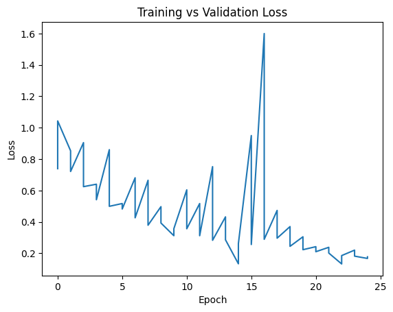
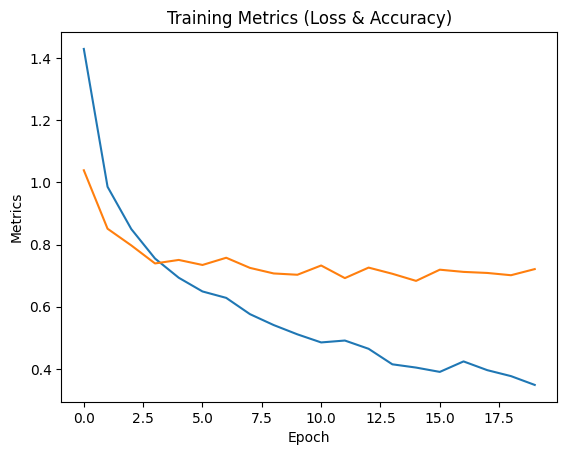
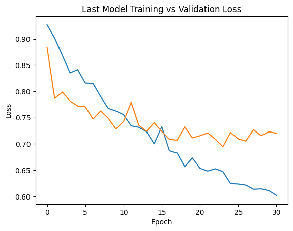

# Model Analysis: 3 Kaggle Experiments

This is the honest timeline of how the model evolved across three Kaggle notebooks in this repo.

Notebooks reviewed:
- Kaggle Notebook 1.ipynb
- Kaggle Notebook 2.ipynb
- Kaggle Notebook 3 FINAL.ipynb

## Experiment 1 (Notebook 1): First Working Baseline

What I tried:
- Architecture: U-Net (segmentation_models_pytorch)
- Encoder: ResNet50 with ImageNet weights
- Output classes: 6
- Input resize: 256x256
- Epochs: 25

What was missing:
- No label remapping
- No augmentation pipeline
- No class-weighted loss
- No early stopping

What happened:
- This was a useful baseline to verify the pipeline end to end.
- But class handling was still rough for the target setup used later.
- In this repo snapshot, notebook outputs do not expose a clean full train/val loss table like the later notebooks, so direct metric comparison is limited.

## Experiment 2 (Notebook 2): Corrected Labels + Better Loss

What changed from Notebook 1:
- Classes changed from 6 to 4.
- Added mask remapping:
  - 1 -> 0
  - 2 -> 1
  - 3 -> 2
  - 6 -> 3
- Kept U-Net ResNet50.
- Loss changed to DiceLoss + CrossEntropyLoss.
- Added early stopping (patience = 5).
- Epoch budget increased to 40 (stopped early).
- Input stayed at 256x256.

Observed results from notebook logs:
- Minimum validation loss: 0.6831
- Last validation loss: 0.7210
- Last train loss: 0.3484
- Early stopping triggered

Takeaway:
- This was the first clearly stable and usable training setup.
- Label remapping plus combined loss made a big practical difference.

## Experiment 3 (Notebook 3 FINAL): Robustness Tuning

What changed from Notebook 2:
- Kept U-Net ResNet50 and 4-class mapping.
- Added augmentation:
  - HorizontalFlip
  - VerticalFlip
  - RandomRotate90
  - ColorJitter
- Added class weighting in CrossEntropyLoss.
- Tried two input sizes in the same notebook flow:
  - 256x256
  - 384x384
- Tried two patience settings:
  - 5
  - 7

Observed results from notebook logs:
- Minimum validation loss: 0.6831
- Last validation loss: 0.7204
- Last train loss: 0.6019
- Early stopping triggered

Takeaway:
- Quantitatively, best validation loss stayed around the same as Notebook 2.
- The final notebook focused more on robustness (augmentation, class imbalance handling, larger input) than on a dramatic loss drop.
- This is a practical final training direction, even if the headline val-loss number did not massively improve.

## Final Notes

- The production app expects a 4-class U-Net style checkpoint and uses the model placed at models/best_model.pth.
- The biggest structural jump happened from Notebook 1 to Notebook 2.
- Notebook 3 was mostly quality hardening.
